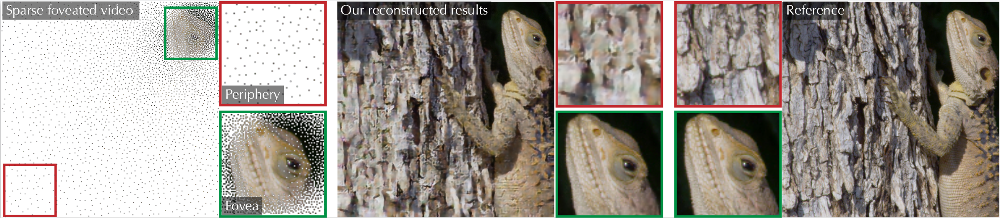
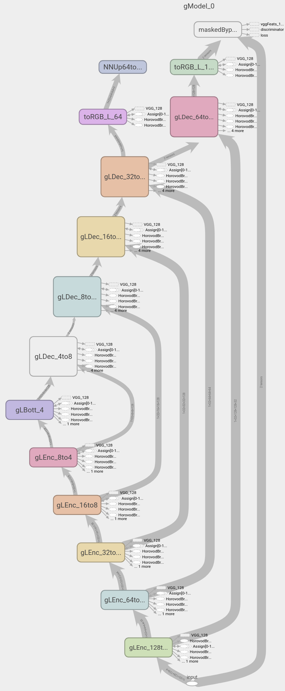
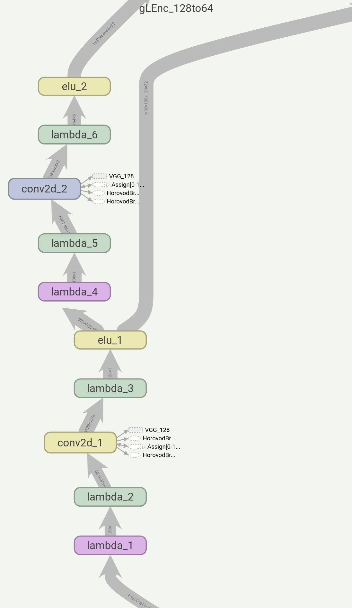
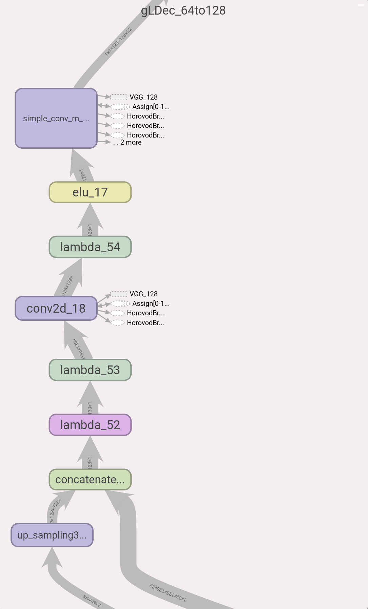
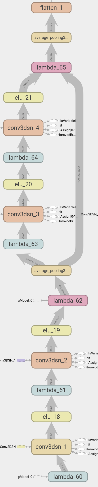
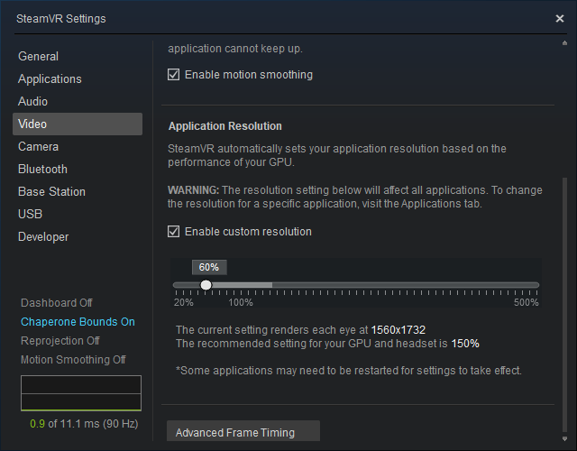

# DeepFovea

<p align='center'>
  
</p>

This repository provides the materials related to the DeepFovea project from Facebook Reality Labs. DeepFovea is a network for a foveated rendering that allows to reconstruct a plausible perifery with a small amount of pixels.

If you use any materials from this repository, please cite the publication: Anton Kaplanyan, Anton Sochenov, Thomas Leimkuehler, Mikhail Okunev, Todd Goodall, Gizem Rufo, "DeepFovea: Neural Reconstruction for Foveated Rendering and Video Compression using Learned Statistics of Natural Videos", SIGGRAPH Asia 2019.

```input_graph.pb``` file contains the network graph for both generator and discriminator.

# Model
## Generator

Generator model is a U-Net with recurrent decoder blocks. The naming convention is ```glEnc_XtoY``` for encoder blocks and ```glDec_YtoX``` for the corresponding decoder blocks, where X and Y change with the depth. The network is trained on 128x128 videos.

<p align='center'>
  
</p>

Each encoder block consists of two convolutions, with the second convolution having a stride 2. We use ELU activation function. There are total 5 encoders and 5 decoders with 32-64-128-128-128 features correspondingly. The model has about 3.2M parameters.

<p align='center'>
  
</p>

Each decoder block consists of an upsampling layer, a convolution and a recurrent convolution layer. The recurrent convolutional layer uses its output as another input on the next time step.

<p align='center'>
  
</p>

## Discriminator

<p align='center'>
  
</p>

The discriminator model consists of several 3D convolutions with residual connections. Each convolution operates on a whole video of 32 frames. This allows the discriminator to reason not only about spatial details, but also about the temporal artifacts. We are using spectral normalization in discriminator for the regularization. There is also a complementary discriminator with a similar architecture trained on the FFT representation of the input video.

## Losses
We are using multiple losses to make the reconstruction plausible
* Adversarial loss (Following WGAN framework)
* LPIPS loss to improve reconstruction of the spatial details
* Optical flow loss to reduce the peripheral flicker

# Inference
"bin" folder contains Windows application "inference.exe". It takes 1 optional argument: screen|360. By default it uses "screen". In "screen" mode it will run full screen with resolution 1920x1088 on monitor 0. To run "360" mode the HTC Vive Pro Eye must be connected. Please follow the <a href="https://www.vive.com/us/support/vive-pro-eye/category_howto/installing-eye-tracking-software.html">instructions</a> to configure eye tracking.

Configuration file "appconfig.json" defines the location of the video frames. Frames can be of any size and will be sampled to match window/HMD resolution. The "gpus" field defines GPU ids to be used. It can take either 1 or 4 values. For example: [0] will use only GPU id 0, [0, 1, 2, 3] will use four GPUs, [0, 0, 1, 1] will use 2 GPUs with ids 1 and 2, [0, 0, 0, 0] will use 1 GPU with id 0. Make sure to always specify id of the GPU your monitor is connected to.

<b>Note</b>: SteamVR sets up default resolution as a result of evaluation of your GPU. In order to speed up network evaluation and fit into 11GB of GPU memory dial custom resolution setting down to be around 1600x1700. If the app crashes with "out of memory" error it indicates that GPU doesn't have enough memory. Try to farther reduce custom resolution.
<p align='center'>
  
</p>

## Pre-requisites
* Windows 10 (build 1909)
* NVIDIA <a href="https://developer.nvidia.com/cuda-10.1-download-archive-base">CUDA 10.1</a> + <a href="https://developer.nvidia.com/rdp/cudnn-download">cuDNN 7.6</a>
* <a href="https://store.steampowered.com/about/">SteamVR</a>
* <a href="https://www.vive.com/us/support/vive-pro-eye/category_howto/installing-eye-tracking-software.html">SRanipal SDK</a> for HTC Vive Pro Eye tracking.

## GPU Requirements
Min
* Screen mode: NVIDIA GEFORCE RTX 2080 - 8GB
* 360 mode: NVIDIA GEFORCE RTX 2080 Ti - 11GB

Recommended
* NVIDIA Quadro GV100 Graphics Card - 32GB

## Key bindings
|Key|Description|
|---|---|
|p|Shows/Hides percent of valid pixels|
|Up/Down arrows|Increases/decreases percent of valid pixels|
|g|Shows/Hides gaze marker|
|f|Shows/Hides time to render a frame per eye|
|r|Enables/Disables reconstruction. Network bypass|
|c|Enables/Disables corruption. All pixels are valid|
|e|Enables/Disables emulation of the gaze by mouse|

# License

DeepFovea is CC-BY-NC 4.0 (FAIR License) licensed, as found in the LICENSE file.
