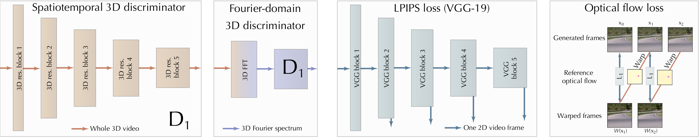

# DeepFovea

<p align='center'>
  
</p>

This repository provides the materials related to the DeepFovea project from Facebook Reality Labs. DeepFovea is a network for a foveated rendering that allows to reconstruct a plausible perifery with a small amount of pixels.

If you use any materials from this repository, please cite the publication: Anton Kaplanyan, Anton Sochenov, Thomas Leimkuehler, Mikhail Okunev, Todd Goodall, Gizem Rufo, "DeepFovea: Neural Reconstruction for Foveated Rendering and Video Compression using Learned Statistics of Natural Videos", SIGGRAPH Asia 2019.

At the moment we are releasing only the full graph structure without the weights. We are planning to release the source code and the final weights soon.

```input_graph.pb``` file contains the network graph for both generator and discriminator.

# Model
## Generator

Generator model is a U-Net with recurrent decoder blocks.

<p align='center'>
  
</p>

Each encoder block consists of two convolutions, with the second convolution having a stride 2. We use ELU activation function. There are total 5 encoders and 5 decoders with 32-64-128-128-128 features correspondingly. The model has about 3.2M parameters.

Each decoder block consists of an upsampling layer, a convolution and a recurrent convolution layer. The recurrent convolutional layer uses its output as another input on the next time step.

The network is trained on 128x128 videos.

## Losses

<p align='center'>
  
</p>

We are using multiple losses to make the reconstruction plausible
* Adversarial loss (Following WGAN framework) 
  
  The discriminator model consists of several 3D convolutions with residual connections. Each convolution operates on a whole video of 32 frames. This allows the discriminator to reason not only about spatial details, but also about the temporal artifacts. We are using spectral normalization in discriminator for the regularization. There is also a complementary discriminator with a similar architecture trained on the FFT representation of the input video.
* LPIPS loss to improve reconstruction of the spatial details
* Optical flow loss to reduce the peripheral flicker

# Pretrained model weights and binaries

Coming soon.

# License

DeepFovea is CC-BY-NC 4.0 (FAIR License) licensed, as found in the LICENSE file.
